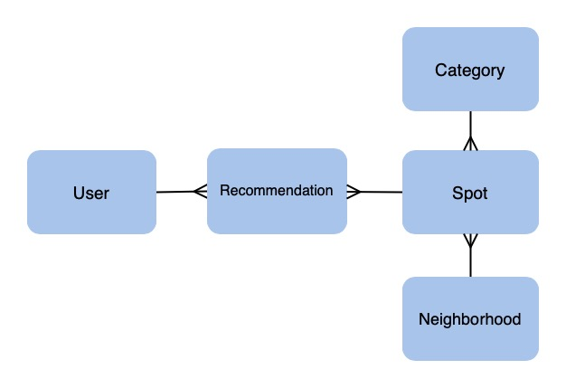

# LOCAL NYC
LOCAL NYC is a web application that allows locals from NYC to share and explore other users' favorite spots in NYC. Spots are based in the five boroughs and shown based on the neighborhood they are located in. Users can add what they recommend about a spot and if they don't see one listed, can add a spot as well. 

[Link to backend](https://github.com/wlcreate/Mod4_Project_backend)

[Link to video demo](https://youtu.be/954c0xCiL9U)

<p align="center">
 
</p>

## Getting Started
1. Clone down the [Rails backend](https://github.com/wlcreate/Mod4_Project_backend) --git clone
2. Clone down this repo into local machine --git clone
3. cd into the directory
4. Install all dependencies
```
npm install
```
5. Start the Rails server
6. Open up a new terminal and run this app
```
npm start
```

## Features

### Password Authentication
 * Validate current users and keeps them logged in using JWT
 * Authenticate users' passwords with BCrypt
 
 ### CRUD Operations
 Users can: 
 * log into the application 
 * see all of their recommendations on their profile
 * sign up to create an account
 * stay logged in if they never logged out
 * update their account
 * add a spot to a neighborhood and assign it a category
 * see information about a specific spot
 * add a recommendation for a specific spot
 * delete a recommendation for a specific spot
 * see all of the recommendations for a spot
 
 ### Active Record Associations
 * There are 5 models that have the following associations ```has_many```, ```belongs_to``` and ```has_many, through: ```
 
 ## Domain Model
 
 
 ## Tech Stack
 * React.js
 * Ruby on Rails API (Backend: https://github.com/wlcreate/Mod4_Project_backend)
 * PostgreSQL
 * HTML/CSS
 * Active Record
 
 ## Tools
 * Rack CORS
 * ActiveModel::Serializer
 * BCrypt
 * Semantic UI
 * React Router
 
 ## Build Status
 * This project was completed in 5 days for the purpose of the project presentation.
 
 ## Contributors
 * [Bella Evalle](https://github.com/BellaEvalle)
 * [Waverley Leung](https://github.com/wlcreate)
 
 ## Acknowledgements
 We would like to thank:
  * Sylwia Vargas
  * Eric Kim
  * Annie Zheng
  * the Code Bender Cohort
